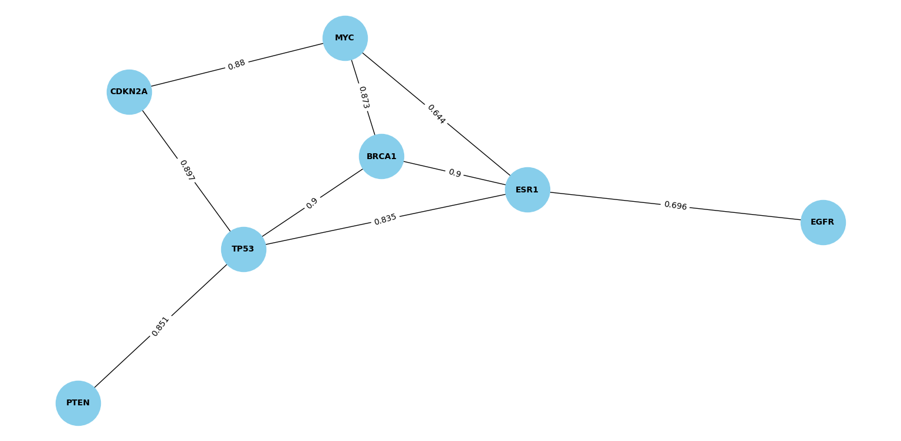

# STRING-PPI-Network-Analyzer

> This repository contains a Python script that identifies and prints interactions between a given list of proteins as per the user interest. 
> The script fetches interaction data from the STRING database API and filters interactions with a medium or higher confidence experimental score.

## Steps
- Fetches PPI data from the STRING database API
- Filters interactions based on experimental confidence scores
- Outputs interactions with a medium or higher confidence score
- Saves the interaction data to a CSV file for further analysis
- Plots the interaction network

## Usage

You need to have Python installed on your machine with the required Python packages. 
You can do this using the following commands:

```sh
git clone https://github.com/GirmaSis/STRING-PPI-Network-Analyzer.git
cd STRING-PPI-Network-Analyzer
pip install -r requirements.txt

```
### Sample proteins to run the script using command:
```sh
python ppi_network_analyzer.py -g TP53 BRCA1 EGFR VEGFA -o output_1.csv -t 0.4
python ppi_network_analyzer.py -g TP53 BRCA1 EGFR VEGFA MYC PTEN ESR1 CDKN2A -o output_2.csv -t 0.4
python ppi_network_analyzer.py -g AKT1 GSK3B MTOR MAPK1 MAPK3 JUN FOS RPS6KB1 RPS6 EIF4EBP1 -o output_3.csv -t 0.4
```
***Protein-Protein Interaction Network: TP53 BRCA1 EGFR VEGFA MYC PTEN ESR1 CDKN2A *** 


*** Protein-Protein Interaction Network: GSK3B MTOR MAPK1 MAPK3 JUN FOS RPS6KB1 RPS6 EIF4EBP1 *** 


